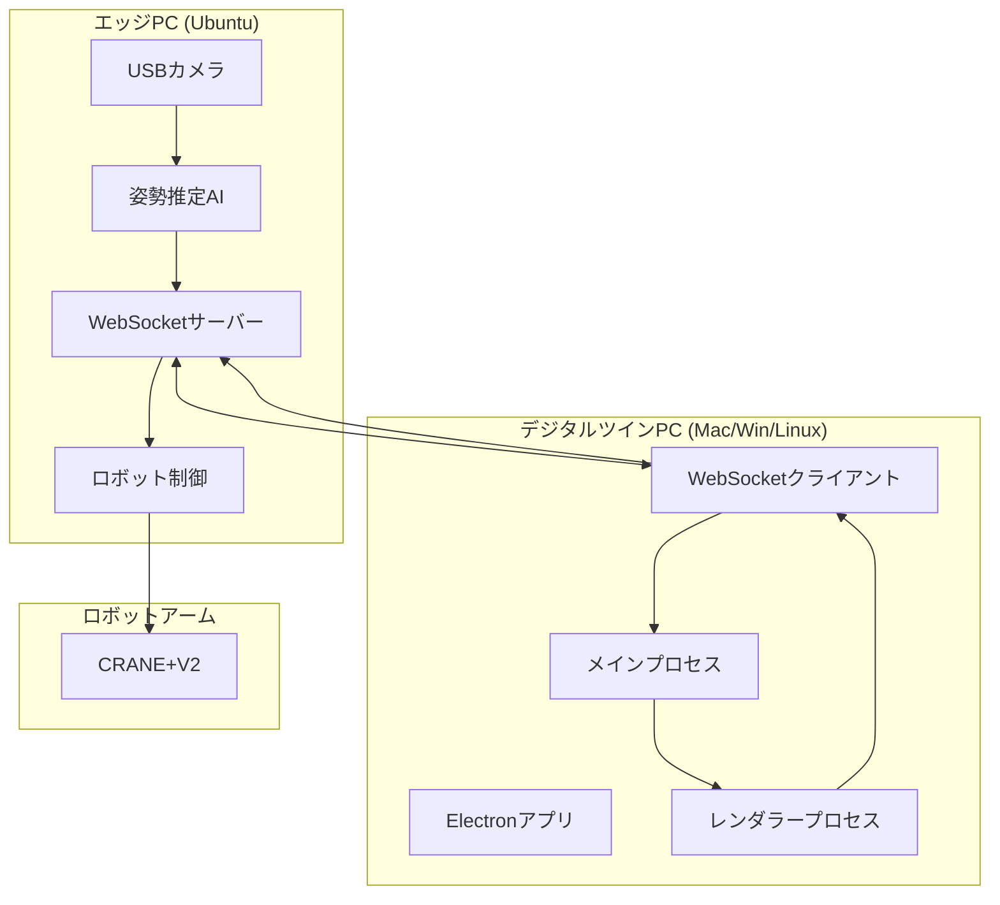

# 設計書

## 概要

製造現場デジタルツインデモシステムは、Electronフレームワークを使用したクロスプラットフォーム対応のデスクトップアプリケーションです。エッジPCとWebSocket通信を行い、リアルタイムで作業者とロボットの協調動作を可視化します。

## アーキテクチャ

### システム構成図



### 通信プロトコル

WebSocket通信で以下のメッセージ形式を使用：

```json
{
  "type": "sensor_data",
  "timestamp": "2024-01-01T12:00:00Z",
  "data": {
    "image": "base64_encoded_image",
    "worker_status": "screw_tightening",
    "robot_status": "waiting",
    "screw_count": 3,
    "bolt_count": 1,
    "work_step": "screw_tightening"
  }
}
```

## コンポーネントと インターフェース

### 1. メインプロセス (Main Process)

**責任:**
- WebSocket接続管理
- レンダラープロセスとの通信
- アプリケーションライフサイクル管理

**主要クラス:**
- `WebSocketManager`: WebSocket接続とメッセージ処理
- `DataProcessor`: 受信データの前処理と検証
- `RobotCommandSender`: ロボットへの指示送信

### 2. レンダラープロセス (Renderer Process)

**責任:**
- レスポンシブUI表示とユーザーインタラクション
- リアルタイムデータの可視化とアニメーション
- 設定管理と通知システム

**主要コンポーネント:**
- `LiveVideoDisplay`: 骨格重ね合わせ画像表示（レスポンシブ対応）
- `StatusIndicator`: 作業者・ロボット状態表示（アニメーション付き）
- `ProgressChart`: 円グラフでの進捗表示（エフェクト付き）
- `TimelineChart`: 作業履歴タイムチャート（リアルタイム更新）
- `SettingsPanel`: 閾値設定パネル
- `EfficiencyIndicator`: リアルタイム効率指標
- `NotificationSystem`: 通知・アラートシステム
- `StatsDashboard`: 統計情報ダッシュボード
- `ConnectionMonitor`: 接続品質モニター
- `ResponsiveLayout`: レスポンシブレイアウト管理

### 3. データ管理層

**主要クラス:**
- `WorkDataStore`: 作業データの状態管理
- `HistoryManager`: 作業履歴の記録・管理
- `ThresholdManager`: 閾値設定の管理

### 4. モックWebSocketサーバー

**責任:**
- 開発・テスト用のダミーデータ送信
- 様々なシナリオのシミュレーション

## データモデル

### WorkerStatus
```typescript
type WorkerStatus = 'waiting' | 'screw_tightening' | 'tool_handover' | 'bolt_tightening' | 'absent';
```

### RobotStatus
```typescript
interface RobotStatus {
  state: 'waiting' | 'operating';
  grip: 'open' | 'closed';
}
```

### WorkData
```typescript
interface WorkData {
  timestamp: Date;
  workerStatus: WorkerStatus;
  robotStatus: RobotStatus;
  screwCount: number;
  boltCount: number;
  image?: string; // base64 encoded
}
```

### ThresholdSettings
```typescript
interface ThresholdSettings {
  screwThreshold: number;
  boltThreshold: number;
}
```

## UI設計

### レスポンシブデザイン仕様

**基準解像度:** 1920x1080 (16:9)
**対応範囲:** 最小1280x720から4K解像度まで
**レイアウト方式:** CSS Grid + Flexboxによる流動レイアウト
**スケーリング:** ビューポートサイズに応じた比例拡大縮小

### カラーパレット

**プライマリカラー:**
- ベースホワイト: #FFFFFF (背景色)
- ライトグレー: #F8F9FA (セクション背景)
- ミディアムグレー: #6C757D (境界線・補助テキスト)
- ダークグレー: #343A40 (メインテキスト)

**機能カラー:**
- 成功・正常: #28A745 (控えめなグリーン)
- 注意・警告: #FFC107 (落ち着いたイエロー)
- エラー・異常: #DC3545 (明確なレッド)
- 情報・アクセント: #007BFF (控えめなブルー)

### メイン画面レイアウト

```
┌─────────────────────────────────────────────────────────────┐
│ 製造現場デジタルツイン        効率: 95%    接続: 正常        │
├─────────────────────────────────────────────────────────────┤
│ ┌─────────────────┐ ┌─────────────────┐ ┌─────────────────┐ │
│ │                 │ │   作業者状態     │ │   ロボット状態   │ │
│ │   ライブ映像     │ │   ネジ締め中    │ │    待機中       │ │
│ │  (骨格重ね合わせ) │ │   ● アクティブ   │ │   ● 正常動作    │ │
│ │                 │ │                 │ │                 │ │
│ └─────────────────┘ └─────────────────┘ └─────────────────┘ │
├─────────────────────────────────────────────────────────────┤
│ ┌─────────────────┐ ┌─────────────────┐ ┌─────────────────┐ │
│ │ ネジ締め進捗     │ │ ボルト締め進捗   │ │ 現在の作業      │ │
│ │  [シンプル円グラフ]│ │  [シンプル円グラフ]│ │   ステップ表示   │ │
│ │   3/5 完了      │ │   1/3 完了      │ │  経過時間       │ │
│ │  残り: 2回      │ │  残り: 2回      │ │  作業効率       │ │
│ └─────────────────┘ └─────────────────┘ └─────────────────┘ │
├─────────────────────────────────────────────────────────────┤
│ ┌─────────────────────────────────────────────────────────┐ │
│ │          作業履歴タイムチャート & 統計情報               │ │
│ │ [クリーンな時系列グラフ + 必要最小限の統計]             │ │
│ │ 総作業時間: 45分 | 完了タスク: 8件 | 平均効率: 92%        │ │
│ └─────────────────────────────────────────────────────────┘ │
├─────────────────────────────────────────────────────────────┤
│ [設定] [接続状態: 接続中] [ログ] [通知: 2件]                │
└─────────────────────────────────────────────────────────────┘
```

### デザイン原則

**1. シンプルさ重視**
- 必要最小限の情報のみ表示
- 余白を活用したクリーンなレイアウト
- 装飾的要素を排除し、機能性を優先

**2. 視認性の向上**
- 高コントラストによる文字の読みやすさ
- 大きめのフォントサイズ（最小14px）
- 明確な境界線とセクション分け

**3. 控えめなアニメーション**
- 状態変化時の最小限のトランジション（200ms以下）
- 注意喚起は色変化のみ（点滅や派手な効果は避ける）
- データ更新時のスムーズな変化

**4. 実用的な情報表示**
- 数値は大きく、明確に表示
- 状態は●○などのシンプルなインジケーター
- グラフは単色でクリーンなデザイン

**5. 製造現場に適した配色**
- 白ベースで清潔感を演出
- 機能的な色使い（緑=正常、赤=異常、黄=注意）
- 目に優しいコントラスト比の確保

### 状態表示デザイン

**作業者状態表示:**
- 待機: 「待機中」テキスト + グレーの●インジケーター
- ネジ締め: 「ネジ締め中」テキスト + 緑の●インジケーター
- ボルト締め: 「ボルト締め中」テキスト + 緑の●インジケーター
- 工具受け渡し: 「工具受け渡し中」テキスト + 青の●インジケーター
- 不在: 「不在」テキスト + グレーの○インジケーター

**ロボット状態表示:**
- 待機: 「待機中」テキスト + グレーの●インジケーター
- 稼働: 「稼働中」テキスト + 緑の●インジケーター
- グリップ開: 「グリップ: 開」テキスト表示
- グリップ閉: 「グリップ: 閉」テキスト表示

**進捗表示:**
- シンプルな円グラフ（単色、グラデーションなし）
- 数値は大きく、明確に表示
- 完了率をパーセンテージで併記

## エラーハンドリング

### WebSocket接続エラー
- 自動再接続機能（指数バックオフ）
- 接続状態の視覚的表示
- オフライン時のローカルデータ保持

### データ検証エラー
- 不正なデータ形式の検出とログ出力
- デフォルト値での継続動作
- エラー通知の表示

### ロボット制御エラー
- 指示送信失敗時のリトライ機能
- エラーログの記録
- 手動制御モードへの切り替え

## テスト戦略

### 単体テスト
- Jest + Electron Testing Libraryを使用
- モックWebSocketサーバーでの通信テスト
- コンポーネント単位でのUI動作テスト

### 統合テスト
- エンドツーエンドでのデータフロー検証
- WebSocket通信の安定性テスト
- 異常系シナリオでの動作確認

### テストデータ
モックサーバーで以下のシナリオを提供：
1. 正常な作業フロー
2. 閾値達成時の動作
3. 接続断・復旧
4. 異常データ受信
5. ロボット制御エラー

## 技術スタック

### フロントエンド
- **Electron**: クロスプラットフォーム対応
- **React**: UI コンポーネント
- **TypeScript**: 型安全性
- **Chart.js**: グラフ表示
- **Socket.io-client**: WebSocket通信

### 開発・テスト
- **Jest**: 単体テスト
- **Electron Testing Library**: E2Eテスト
- **ESLint + Prettier**: コード品質
- **Webpack**: バンドル

### モックサーバー
- **Node.js + Express**: HTTPサーバー
- **Socket.io**: WebSocketサーバー
- **JSON設定ファイル**: テストシナリオ管理