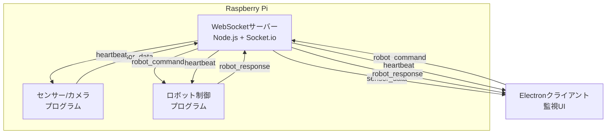
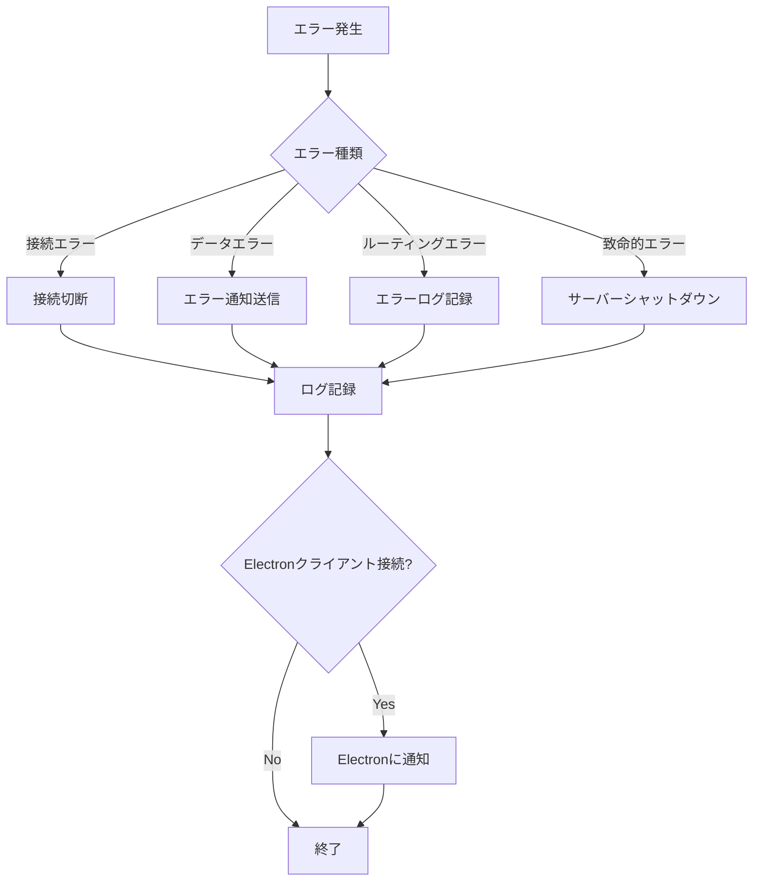

# 設計書

## 概要

ラズパイ上で動作するWebSocketサーバーを構築します。このサーバーは、Electronクライアント、センサー/カメラプログラム、ロボット制御プログラム間のデータ中継を担当します。Node.jsとSocket.ioを使用し、軽量で効率的な実装を目指します。

## アーキテクチャ

### システム構成図



### データフロー

1. **センサーデータフロー**
   - センサー/カメラプログラム → WSサーバー → Electronクライアント

2. **ロボット制御フロー**
   - Electronクライアント → WSサーバー → ロボット制御プログラム → WSサーバー → Electronクライアント

3. **ヘルスチェックフロー**
   - 外部監視システム → HTTPエンドポイント → ヘルスチェック応答

### クライアント識別

各接続クライアントは接続時に`client_type`を送信します：

- `electron`: Electronクライアント（複数接続可能）
- `sensor`: センサー/カメラプログラム（1接続のみ）
- `robot`: ロボット制御プログラム（1接続のみ）
- `unknown`: タイプ未指定（デフォルト）

## コンポーネントと インターフェース

### 1. WebSocketサーバー（MainServer）

**責務:**
- WebSocket接続の管理
- クライアントタイプの識別と登録
- データの中継
- ヘルスチェックAPIの提供

**主要メソッド:**
```typescript
class MainServer {
  constructor(config: ServerConfig)
  start(): Promise<void>
  stop(): Promise<void>
  handleConnection(socket: Socket): void
  handleDisconnection(socket: Socket): void
  getHealthStatus(): HealthStatus
}
```

### 2. 接続マネージャー（ConnectionManager）

**責務:**
- クライアント接続の追跡
- クライアントタイプ別の管理
- 接続状態の監視

**主要メソッド:**
```typescript
class ConnectionManager {
  registerClient(socketId: string, clientType: ClientType, socket: Socket): void
  unregisterClient(socketId: string): void
  getClientsByType(clientType: ClientType): Socket[]
  getSensorClient(): Socket | null
  getRobotClient(): Socket | null
  getElectronClients(): Socket[]
  getConnectionStats(): ConnectionStats
  isClientConnected(clientType: ClientType): boolean
}
```

### 3. メッセージルーター（MessageRouter）

**責務:**
- メッセージの種類に応じた適切なルーティング
- データの検証
- エラーハンドリング

**主要メソッド:**
```typescript
class MessageRouter {
  routeSensorData(data: SensorData, fromSocket: Socket): void
  routeRobotCommand(command: RobotCommand, fromSocket: Socket): void
  routeRobotResponse(response: RobotResponse, fromSocket: Socket): void
  sendErrorResponse(socket: Socket, error: ErrorInfo): void
}
```

### 4. ハートビートマネージャー（HeartbeatManager）

**責務:**
- 定期的なハートビート送信
- クライアントの生存確認
- タイムアウト検出

**主要メソッド:**
```typescript
class HeartbeatManager {
  startHeartbeat(socket: Socket): void
  stopHeartbeat(socketId: string): void
  handlePong(socketId: string): void
  checkTimeouts(): void
}
```

### 5. ロガー（Logger）

**責務:**
- ログの記録
- ログレベルの管理
- ログファイルのローテーション

**主要メソッド:**
```typescript
class Logger {
  debug(message: string, meta?: object): void
  info(message: string, meta?: object): void
  warn(message: string, meta?: object): void
  error(message: string, error?: Error, meta?: object): void
}
```

### 6. 設定マネージャー（ConfigManager）

**責務:**
- 設定ファイルの読み込み
- デフォルト設定の提供
- 設定の検証

**主要メソッド:**
```typescript
class ConfigManager {
  static load(configPath?: string): ServerConfig
  static validate(config: ServerConfig): boolean
  static getDefault(): ServerConfig
}
```

## データモデル

### ServerConfig

```typescript
interface ServerConfig {
  port: number;                    // デフォルト: 3001
  cors_origin: string;             // デフォルト: "*"
  heartbeat_interval: number;      // デフォルト: 30000 (30秒)
  connection_timeout: number;      // デフォルト: 60000 (60秒)
  log_level: LogLevel;             // デフォルト: "info"
  log_file: string;                // デフォルト: "logs/server.log"
}

type LogLevel = "debug" | "info" | "warn" | "error";
```

### ClientType

```typescript
type ClientType = "electron" | "sensor" | "robot" | "unknown";
```

### SensorData

```typescript
interface SensorData {
  worker_status: WorkerStatus;
  robot_status: RobotStatus;
  screw_count: number;
  bolt_count: number;
  work_step: string;
  image?: string;  // Base64エンコード画像（オプション）
  timestamp?: string;
}

type WorkerStatus = "waiting" | "screw_tightening" | "bolt_tightening" | "tool_handover" | "absent";

interface RobotStatus {
  state: "waiting" | "operating";
  grip: "open" | "closed";
}
```

### RobotCommand

```typescript
interface RobotCommand {
  command: CommandType;
  data?: any;
  timestamp: string;
}

type CommandType = "tool_handover" | "next_task" | "emergency_stop" | "reset";
```

### RobotResponse

```typescript
interface RobotResponse {
  command: CommandType;
  status: ResponseStatus;
  timestamp: string;
  data?: any;
}

type ResponseStatus = "success" | "error" | "emergency_stopped";
```

### HealthStatus

```typescript
interface HealthStatus {
  status: "ok" | "error";
  timestamp: string;
  connections: {
    electron: number;
    sensor: number;
    robot: number;
    unknown: number;
    total: number;
  };
  sensor_connected: boolean;
  robot_connected: boolean;
}
```

### ConnectionStats

```typescript
interface ConnectionStats {
  total: number;
  byType: {
    electron: number;
    sensor: number;
    robot: number;
    unknown: number;
  };
}
```

## イベント定義

### クライアント → サーバー

| イベント名 | 送信元 | データ型 | 説明 |
|-----------|--------|---------|------|
| `register_client` | 全クライアント | `{ client_type: ClientType }` | クライアントタイプの登録 |
| `sensor_data` | センサープログラム | `SensorData` | センサーデータ送信 |
| `robot_command` | Electronクライアント | `RobotCommand` | ロボット制御指示 |
| `robot_response` | ロボット制御プログラム | `RobotResponse` | ロボット応答 |
| `pong` | 全クライアント | `{ timestamp: number }` | ハートビート応答 |

### サーバー → クライアント

| イベント名 | 送信先 | データ型 | 説明 |
|-----------|--------|---------|------|
| `sensor_data` | Electronクライアント | `SensorData` | センサーデータ転送 |
| `robot_command` | ロボット制御プログラム | `RobotCommand` | ロボット制御指示転送 |
| `robot_response` | Electronクライアント | `RobotResponse` | ロボット応答転送 |
| `ping` | 全クライアント | `{ timestamp: number }` | ハートビート |
| `error` | 該当クライアント | `ErrorInfo` | エラー通知 |
| `external_disconnected` | Electronクライアント | `{ client_type: ClientType }` | 外部プログラム切断通知 |

### ErrorInfo

```typescript
interface ErrorInfo {
  code: string;
  message: string;
  timestamp: string;
}
```

## エラーハンドリング

### エラーコード定義

| コード | 説明 | 対応 |
|-------|------|------|
| `SENSOR_NOT_CONNECTED` | センサープログラム未接続 | Electronクライアントにエラー応答 |
| `ROBOT_NOT_CONNECTED` | ロボット制御プログラム未接続 | Electronクライアントにエラー応答 |
| `INVALID_DATA_FORMAT` | データ形式不正 | エラーログ記録、送信元にエラー通知 |
| `ROUTING_ERROR` | ルーティングエラー | エラーログ記録、該当クライアントにエラー通知 |
| `CONNECTION_TIMEOUT` | 接続タイムアウト | 接続切断、ログ記録 |
| `DUPLICATE_CLIENT_TYPE` | 重複クライアントタイプ | 既存接続を切断、新規接続を受け入れ |

### エラー処理フロー



## テスト戦略

### 単体テスト

**対象コンポーネント:**
- ConnectionManager
- MessageRouter
- HeartbeatManager
- ConfigManager
- Logger

**テストケース例:**
```typescript
describe('ConnectionManager', () => {
  test('should register client with correct type', () => {
    // クライアント登録のテスト
  });
  
  test('should return sensor client when registered', () => {
    // センサークライアント取得のテスト
  });
  
  test('should handle duplicate sensor connection', () => {
    // 重複接続処理のテスト
  });
});
```

### 統合テスト

**テストシナリオ:**

1. **基本接続テスト**
   - 各タイプのクライアントが正常に接続できること
   - クライアントタイプが正しく識別されること

2. **データ中継テスト**
   - センサーデータがElectronクライアントに正しく転送されること
   - ロボット指示がロボット制御プログラムに正しく転送されること
   - ロボット応答がElectronクライアントに正しく転送されること

3. **エラーハンドリングテスト**
   - 外部プログラム未接続時のエラー応答
   - 不正なデータ形式の処理
   - 接続タイムアウトの検出

4. **ハートビートテスト**
   - 定期的なハートビート送信
   - タイムアウト検出と接続切断

5. **ヘルスチェックテスト**
   - ヘルスチェックAPIの応答
   - 接続状態の正確な報告

### 負荷テスト

**テスト項目:**
- 複数Electronクライアント同時接続（10クライアント）
- 高頻度データ送信（1秒間に10メッセージ）
- 長時間運用（24時間）でのメモリリーク確認

### ラズパイ実機テスト

**テスト項目:**
- メモリ使用量の確認（512MB以下）
- CPU使用率の確認（50%以下）
- 起動時間の確認
- systemdサービスとしての動作確認

## パフォーマンス最適化

### メモリ最適化

1. **オブジェクトプール**
   - 頻繁に生成されるオブジェクトの再利用
   - ログメッセージオブジェクトのプール化

2. **データストリーミング**
   - 大きな画像データのストリーミング転送
   - バッファサイズの最適化

3. **ガベージコレクション**
   - 定期的なメモリ使用量チェック
   - 閾値超過時の手動GC実行

### CPU最適化

1. **非同期処理**
   - すべてのI/O操作を非同期化
   - イベントループのブロッキング回避

2. **データ検証の最適化**
   - 必要最小限の検証
   - 高速なJSON解析

### ネットワーク最適化

1. **データ圧縮**
   - 大きなデータの圧縮転送（オプション）
   - WebSocket圧縮拡張の利用

2. **バッチ処理**
   - 複数メッセージのバッチ送信（必要に応じて）

## セキュリティ考慮事項

### 認証・認可

現バージョンでは認証機能は実装しませんが、将来的な拡張のために以下を考慮：

- JWT認証の追加
- クライアントタイプごとのアクセス制御
- APIキーによる認証

### データ検証

- 受信データの型チェック
- データサイズの制限
- 不正なイベント名の拒否

### ネットワークセキュリティ

- CORS設定による接続元制限
- レート制限（DoS対策）
- 接続数制限

## デプロイメント

### ディレクトリ構造

```
raspberry-pi-websocket-server/
├── src/
│   ├── index.ts                 # エントリーポイント
│   ├── server/
│   │   ├── MainServer.ts
│   │   ├── ConnectionManager.ts
│   │   ├── MessageRouter.ts
│   │   └── HeartbeatManager.ts
│   ├── utils/
│   │   ├── Logger.ts
│   │   └── ConfigManager.ts
│   └── types/
│       └── index.ts             # 型定義
├── config/
│   └── config.json              # 設定ファイル
├── logs/                        # ログディレクトリ
├── tests/
│   ├── unit/
│   └── integration/
├── package.json
├── tsconfig.json
└── README.md
```

### 依存パッケージ

```json
{
  "dependencies": {
    "socket.io": "^4.6.0",
    "express": "^4.18.0",
    "cors": "^2.8.5",
    "winston": "^3.11.0",
    "winston-daily-rotate-file": "^4.7.1"
  },
  "devDependencies": {
    "@types/node": "^20.0.0",
    "@types/express": "^4.17.0",
    "@types/cors": "^2.8.0",
    "typescript": "^5.0.0",
    "jest": "^29.0.0",
    "@types/jest": "^29.0.0",
    "ts-jest": "^29.0.0",
    "socket.io-client": "^4.6.0"
  }
}
```

### systemdサービス設定

```ini
[Unit]
Description=Manufacturing WebSocket Server
After=network.target

[Service]
Type=simple
User=pi
WorkingDirectory=/home/pi/raspberry-pi-websocket-server
ExecStart=/usr/bin/node dist/index.js
Restart=always
RestartSec=10
StandardOutput=journal
StandardError=journal

[Install]
WantedBy=multi-user.target
```

### ビルドとデプロイ手順

1. **ビルド**
   ```bash
   npm run build
   ```

2. **ラズパイへの転送**
   ```bash
   rsync -avz --exclude node_modules . pi@raspberrypi:/home/pi/raspberry-pi-websocket-server/
   ```

3. **ラズパイ上でのセットアップ**
   ```bash
   ssh pi@raspberrypi
   cd raspberry-pi-websocket-server
   npm install --production
   ```

4. **systemdサービス登録**
   ```bash
   sudo cp raspberry-pi-websocket-server.service /etc/systemd/system/
   sudo systemctl daemon-reload
   sudo systemctl enable raspberry-pi-websocket-server
   sudo systemctl start raspberry-pi-websocket-server
   ```

5. **動作確認**
   ```bash
   sudo systemctl status raspberry-pi-websocket-server
   curl http://localhost:3001/health
   ```

## 監視とメンテナンス

### ログ監視

```bash
# リアルタイムログ確認
tail -f logs/server.log

# systemdログ確認
sudo journalctl -u raspberry-pi-websocket-server -f
```

### ヘルスチェック

```bash
# 定期的なヘルスチェック
watch -n 5 'curl -s http://localhost:3001/health | jq'
```

### メモリ監視

```bash
# プロセスのメモリ使用量確認
ps aux | grep node
```

### 再起動

```bash
# サービス再起動
sudo systemctl restart raspberry-pi-websocket-server
```

## 今後の拡張

1. **認証機能の追加**
   - JWT認証の実装
   - クライアント証明書による認証

2. **データ永続化**
   - センサーデータの記録
   - 履歴データの提供

3. **WebUI管理画面**
   - サーバー状態の可視化
   - 設定変更UI

4. **メトリクス収集**
   - Prometheusメトリクスのエクスポート
   - Grafanaダッシュボード

5. **高可用性**
   - 複数サーバーでの負荷分散
   - Redisを使用したセッション共有
