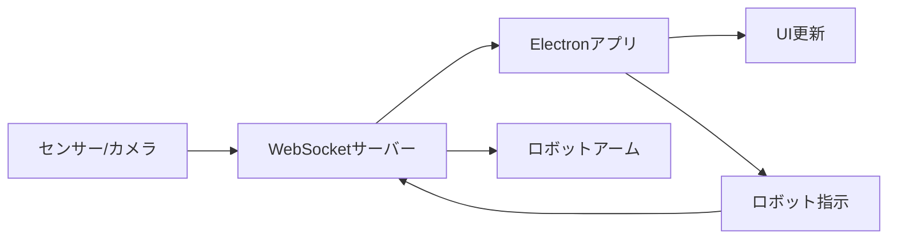

# 製造現場デジタルツインデモ

製造現場における人とロボットの協調動作を可視化するElectronベースのデスクトップアプリケーションです。

## 機能概要

### 主要機能
- **リアルタイム監視**: 作業者・ロボット状態のリアルタイム表示
- **進捗可視化**: ネジ締め・ボルト締めの進捗を円グラフで表示
- **履歴管理**: 作業履歴をタイムチャートで可視化
- **WebSocket通信**: リアルタイムデータ受信・送信
- **ロボット制御**: ロボットアームへの指示送信と応答監視
- **パフォーマンス最適化**: デバイス性能に応じた動的最適化
- **レスポンシブデザイン**: 様々な画面サイズに対応

### 最適化機能
- **パフォーマンス監視**: メモリ、CPU、フレームレートのリアルタイム監視
- **アニメーション最適化**: デバイス性能に応じたアニメーション調整
- **データ統合管理**: バッチ処理による効率的なデータフロー
- **メモリ最適化**: オブジェクトプールと自動ガベージコレクション

## 技術スタック

- **Electron**: クロスプラットフォーム対応
- **React + TypeScript**: UI開発
- **Chart.js**: グラフ表示
- **Socket.io**: WebSocket通信
- **Webpack**: バンドル
- **Jest**: テスト

## クイックスタート

### 1. 依存関係のインストール

```bash
npm install
```

### 2. プロジェクトのビルド

```bash
npm run build:dev
```

### 3. モックサーバーの起動（別ターミナル）

```bash
npm run mock-server
```

### 4. アプリケーションの起動

```bash
npm start
```

または開発モード（ホットリロード付き）:

```bash
npm run dev
```

### 5. 動作確認

1. アプリケーションが起動すると、自動的に `ws://localhost:3001` に接続します
2. 接続状態は画面右上の「🟢 接続良好」で確認できます
3. モックサーバーから2秒間隔でセンサーデータが送信され、リアルタイムで画面が更新されます
4. 「🤖 ロボット制御」ボタンからロボットへの指示送信をテストできます

## 開発コマンド

- `npm run build` - プロダクションビルド
- `npm run build:dev` - 開発ビルド
- `npm run dev` - 開発モード（ホットリロード）
- `npm run test` - テスト実行
- `npm run lint` - ESLintチェック
- `npm run format` - Prettierフォーマット
- `npm run mock-server` - モックWebSocketサーバー起動

## プロジェクト構造

```
src/
├── main/           # Electronメインプロセス
├── renderer/       # Reactレンダラープロセス
├── mock-server/    # モックWebSocketサーバー
└── types/          # TypeScript型定義
```

## WebSocket通信とデータ連携

### 接続設定

アプリケーションは起動時に自動的にWebSocketサーバーに接続します。

**デフォルト設定:**
- URL: `ws://localhost:3001`
- 再接続試行回数: 10回
- 再接続間隔: 1秒
- タイムアウト: 5秒

**環境変数による設定変更:**
```bash
# WebSocketサーバーのURL変更
export WEBSOCKET_URL=ws://your-server:port

# アプリケーション起動
npm start
```

### データフロー



### 受信データ形式

#### センサーデータ (`sensor_data`)

```json
{
  "image": "data:image/jpeg;base64,/9j/4AAQ...", // Base64エンコードされた画像（オプション）
  "worker_status": "screw_tightening",           // 作業者状態
  "robot_status": {
    "state": "operating",                        // ロボット状態
    "grip": "open"                              // グリップ状態
  },
  "screw_count": 3,                             // ネジ締め回数
  "bolt_count": 1,                              // ボルト締め回数
  "work_step": "screw_tightening"               // 現在の作業ステップ
}
```

**作業者状態 (`worker_status`)**
- `waiting`: 待機中
- `screw_tightening`: ネジ締め作業中
- `bolt_tightening`: ボルト締め作業中
- `tool_handover`: 工具受け渡し中
- `absent`: 不在

**ロボット状態 (`robot_status.state`)**
- `waiting`: 待機中
- `operating`: 動作中

**グリップ状態 (`robot_status.grip`)**
- `open`: 開いている
- `closed`: 閉じている

### 送信データ形式

#### ロボット指示 (`robot_command`)

```json
{
  "command": "tool_handover",                   // 指示コマンド
  "data": {                                     // 追加データ（オプション）
    "tool_type": "screwdriver",
    "position": { "x": 100, "y": 200, "z": 50 }
  },
  "timestamp": "2024-01-01T12:00:00.000Z"     // タイムスタンプ
}
```

**指示コマンド種類**
- `tool_handover`: 工具受け渡し
- `next_task`: 次タスクへ移行
- `emergency_stop`: 緊急停止
- `reset`: リセット

### 接続状態管理

アプリケーションは接続状態を自動監視し、以下の情報を提供します：

- **接続状態**: 接続中/切断中
- **接続品質**: レイテンシとデータレートに基づく品質評価
- **自動再接続**: 切断時の自動再接続機能
- **エラーハンドリング**: 通信エラーの適切な処理

## モックサーバー

開発・テスト用のWebSocketサーバーが含まれています。

### 起動方法

```bash
npm run mock-server
```

### 提供機能

- **HTTP サーバー**: `http://localhost:3001`
  - ヘルスチェック: `GET /health`
  - CORS対応
- **WebSocket サーバー**: `ws://localhost:3001`
  - 自動センサーデータ送信（2秒間隔）
  - ロボットコマンド受信・応答
  - 接続状態管理

### モックデータ生成

モックサーバーは以下のパターンでデータを生成します：

- **作業者状態**: ランダムな状態遷移
- **ロボット状態**: 作業者状態に連動した動作
- **カウント値**: 段階的な増加
- **画像データ**: Base64エンコードされたサンプル画像（オプション）

## 実際のWebSocketサーバー実装ガイド

### サーバー側要件

実際の製造現場で使用する場合、以下の仕様に対応したWebSocketサーバーが必要です。

#### 1. 基本接続

```javascript
// Node.js + Socket.io の例
const io = require('socket.io')(3001, {
  cors: {
    origin: "*",
    methods: ["GET", "POST"]
  }
});

io.on('connection', (socket) => {
  console.log('Client connected:', socket.id);
  
  // 定期的なセンサーデータ送信
  const interval = setInterval(() => {
    socket.emit('sensor_data', {
      worker_status: getCurrentWorkerStatus(),
      robot_status: getCurrentRobotStatus(),
      screw_count: getScrewCount(),
      bolt_count: getBoltCount(),
      work_step: getCurrentWorkStep(),
      image: getCameraImage() // オプション
    });
  }, 1000); // 1秒間隔
  
  // ロボット指示受信
  socket.on('robot_command', (data) => {
    console.log('Robot command received:', data);
    
    // ロボットシステムに指示を転送
    sendCommandToRobot(data.command, data.data);
    
    // 応答送信
    socket.emit('robot_response', {
      command: data.command,
      status: 'success',
      timestamp: new Date().toISOString()
    });
  });
  
  socket.on('disconnect', () => {
    clearInterval(interval);
    console.log('Client disconnected:', socket.id);
  });
});
```

#### 2. センサー統合

```python
# Python の例（センサーデータ収集）
import cv2
import json
import base64
from socketio import Server

class SensorManager:
    def __init__(self):
        self.camera = cv2.VideoCapture(0)
        self.worker_detector = WorkerDetector()
        self.robot_interface = RobotInterface()
    
    def get_sensor_data(self):
        # カメラ画像取得
        ret, frame = self.camera.read()
        image_base64 = None
        if ret:
            _, buffer = cv2.imencode('.jpg', frame)
            image_base64 = base64.b64encode(buffer).decode('utf-8')
            image_base64 = f"data:image/jpeg;base64,{image_base64}"
        
        # 作業者状態検出
        worker_status = self.worker_detector.detect_status(frame)
        
        # ロボット状態取得
        robot_status = self.robot_interface.get_status()
        
        return {
            'image': image_base64,
            'worker_status': worker_status,
            'robot_status': robot_status,
            'screw_count': self.get_screw_count(),
            'bolt_count': self.get_bolt_count(),
            'work_step': worker_status
        }
```

#### 3. ロボット制御統合

```cpp
// C++ の例（ロボット制御）
#include <websocketpp/config/asio_no_tls.hpp>
#include <websocketpp/server.hpp>

class RobotController {
public:
    void handleCommand(const std::string& command, const json& data) {
        if (command == "tool_handover") {
            executeToolHandover(data);
        } else if (command == "next_task") {
            moveToNextTask(data);
        } else if (command == "emergency_stop") {
            emergencyStop();
        }
    }
    
private:
    void executeToolHandover(const json& data) {
        // ロボットアームを工具受け渡し位置に移動
        moveToPosition(data["position"]);
        openGripper();
        // 完了通知
        notifyCompletion("tool_handover", "success");
    }
};
```

### セキュリティ考慮事項

#### 1. 認証・認可

```javascript
// JWT認証の例
const jwt = require('jsonwebtoken');

io.use((socket, next) => {
  const token = socket.handshake.auth.token;
  try {
    const decoded = jwt.verify(token, process.env.JWT_SECRET);
    socket.userId = decoded.userId;
    next();
  } catch (err) {
    next(new Error('Authentication error'));
  }
});
```

#### 2. データ暗号化

```javascript
// TLS/SSL対応
const fs = require('fs');
const https = require('https');

const server = https.createServer({
  key: fs.readFileSync('path/to/private-key.pem'),
  cert: fs.readFileSync('path/to/certificate.pem')
});

const io = require('socket.io')(server);
```

### パフォーマンス最適化

#### 1. データ圧縮

```javascript
// 画像データの圧縮
const sharp = require('sharp');

async function compressImage(imageBuffer) {
  return await sharp(imageBuffer)
    .resize(640, 480)
    .jpeg({ quality: 80 })
    .toBuffer();
}
```

#### 2. 負荷分散

```javascript
// Redis Adapter for Socket.io
const redisAdapter = require('socket.io-redis');
io.adapter(redisAdapter({ host: 'localhost', port: 6379 }));
```

### 監視・ログ

```javascript
// 接続監視
io.engine.on('connection_error', (err) => {
  console.log('Connection error:', err.req, err.code, err.message, err.context);
});

// メトリクス収集
const prometheus = require('prom-client');
const connectionsGauge = new prometheus.Gauge({
  name: 'websocket_connections_total',
  help: 'Total number of WebSocket connections'
});

io.on('connection', (socket) => {
  connectionsGauge.inc();
  socket.on('disconnect', () => {
    connectionsGauge.dec();
  });
});
```

## アプリケーション設定

### 環境変数

```bash
# WebSocket接続設定
WEBSOCKET_URL=ws://your-production-server:port
WEBSOCKET_RECONNECT_ATTEMPTS=10
WEBSOCKET_RECONNECT_DELAY=1000
WEBSOCKET_TIMEOUT=5000

# パフォーマンス設定
ENABLE_PERFORMANCE_MONITORING=true
ANIMATION_PERFORMANCE_MODE=auto  # high, medium, low, auto
MAX_CONCURRENT_ANIMATIONS=10

# ログレベル
LOG_LEVEL=info  # debug, info, warn, error
```

### 設定ファイル

```json
// config/production.json
{
  "websocket": {
    "url": "wss://your-production-server:443",
    "options": {
      "reconnectionAttempts": 10,
      "reconnectionDelay": 1000,
      "timeout": 5000
    }
  },
  "performance": {
    "enableMonitoring": true,
    "animationMode": "auto",
    "maxConcurrentAnimations": 10
  },
  "ui": {
    "updateInterval": 1000,
    "chartMaxDataPoints": 100,
    "enableAnimations": true
  }
}
```

## トラブルシューティング

### 接続問題

1. **WebSocket接続失敗**
   ```bash
   # サーバー状態確認
   curl http://localhost:3001/health
   
   # ネットワーク確認
   telnet localhost 3001
   ```

2. **CORS エラー**
   - サーバー側でCORS設定を確認
   - ブラウザの開発者ツールでエラー詳細を確認

3. **認証エラー**
   - JWT トークンの有効性を確認
   - 認証情報の設定を確認

### パフォーマンス問題

1. **メモリ使用量が多い**
   - パフォーマンスダッシュボードでメトリクス確認
   - 画像データのサイズと頻度を調整
   - ガベージコレクションの実行

2. **アニメーションが重い**
   - デバイス性能に応じた設定調整
   - アニメーション数の制限
   - ハードウェアアクセラレーションの確認

### データ問題

1. **データが更新されない**
   - WebSocket接続状態を確認
   - サーバー側のデータ送信ログを確認
   - ネットワーク遅延の確認

2. **データ形式エラー**
   - 送受信データの形式を確認
   - バリデーション結果を確認
   - エラーログの詳細確認

## 要件対応

このアプリケーションは以下の要件に対応しています：

### 機能要件
- **要件1.1-1.4**: リアルタイム状態表示とライブ映像
- **要件2.1-2.2**: 進捗可視化と閾値比較
- **要件3.1-3.2**: 履歴管理と統計情報
- **要件4.1-4.2**: ロボット制御と通信処理

### 非機能要件
- **要件5.1**: モックWebSocketサーバーによるテスト環境
- **要件5.2**: 包括的な単体テスト
- **要件6.1**: レスポンシブデザイン
- **要件6.2**: パフォーマンス最適化
- **要件6.3**: エラーハンドリング
- **要件6.4**: クロスプラットフォーム対応

## 実装例とサンプルコード

### WebSocketサーバー実装例（完全版）

```javascript
// server.js - 本格的なWebSocketサーバー実装例
const express = require('express');
const http = require('http');
const socketIo = require('socket.io');
const cors = require('cors');
const jwt = require('jsonwebtoken');

class ManufacturingWebSocketServer {
  constructor(port = 3001) {
    this.port = port;
    this.app = express();
    this.server = http.createServer(this.app);
    this.io = socketIo(this.server, {
      cors: {
        origin: "*",
        methods: ["GET", "POST"]
      }
    });
    
    this.clients = new Map();
    this.sensorData = {
      worker_status: 'waiting',
      robot_status: { state: 'waiting', grip: 'closed' },
      screw_count: 0,
      bolt_count: 0,
      work_step: 'waiting'
    };
    
    this.setupMiddleware();
    this.setupRoutes();
    this.setupWebSocket();
  }
  
  setupMiddleware() {
    this.app.use(cors());
    this.app.use(express.json());
  }
  
  setupRoutes() {
    // ヘルスチェック
    this.app.get('/health', (req, res) => {
      res.json({
        status: 'ok',
        timestamp: new Date().toISOString(),
        connections: this.clients.size
      });
    });
    
    // センサーデータ手動更新API
    this.app.post('/sensor-data', (req, res) => {
      this.sensorData = { ...this.sensorData, ...req.body };
      this.broadcastSensorData();
      res.json({ success: true });
    });
    
    // ロボット指示API
    this.app.post('/robot-command', (req, res) => {
      this.handleRobotCommand(req.body);
      res.json({ success: true });
    });
  }
  
  setupWebSocket() {
    // 認証ミドルウェア（オプション）
    this.io.use((socket, next) => {
      const token = socket.handshake.auth.token;
      if (token) {
        try {
          const decoded = jwt.verify(token, process.env.JWT_SECRET || 'demo-secret');
          socket.userId = decoded.userId;
        } catch (err) {
          return next(new Error('Authentication failed'));
        }
      }
      next();
    });
    
    this.io.on('connection', (socket) => {
      console.log(`Client connected: ${socket.id}`);
      
      // クライアント情報を保存
      this.clients.set(socket.id, {
        socket,
        connectedAt: new Date(),
        lastPing: new Date()
      });
      
      // 初期データ送信
      socket.emit('sensor_data', this.sensorData);
      
      // 定期的なセンサーデータ送信
      const dataInterval = setInterval(() => {
        this.updateSensorData();
        socket.emit('sensor_data', this.sensorData);
      }, 1000);
      
      // ハートビート
      const heartbeatInterval = setInterval(() => {
        socket.emit('ping', { timestamp: Date.now() });
      }, 30000);
      
      // ロボット指示受信
      socket.on('robot_command', (data) => {
        this.handleRobotCommand(data, socket);
      });
      
      // ハートビート応答
      socket.on('pong', (data) => {
        const client = this.clients.get(socket.id);
        if (client) {
          client.lastPing = new Date();
        }
      });
      
      // 切断処理
      socket.on('disconnect', (reason) => {
        console.log(`Client disconnected: ${socket.id}, reason: ${reason}`);
        clearInterval(dataInterval);
        clearInterval(heartbeatInterval);
        this.clients.delete(socket.id);
      });
      
      // エラーハンドリング
      socket.on('error', (error) => {
        console.error(`Socket error for ${socket.id}:`, error);
      });
    });
  }
  
  updateSensorData() {
    // 実際の実装では、ここでセンサーやカメラからデータを取得
    const workerStates = ['waiting', 'screw_tightening', 'bolt_tightening', 'tool_handover'];
    const robotStates = ['waiting', 'operating'];
    const gripStates = ['open', 'closed'];
    
    // ランダムな状態変更（実際の実装では実際のセンサーデータを使用）
    if (Math.random() > 0.8) {
      this.sensorData.worker_status = workerStates[Math.floor(Math.random() * workerStates.length)];
    }
    
    if (Math.random() > 0.7) {
      this.sensorData.robot_status.state = robotStates[Math.floor(Math.random() * robotStates.length)];
      this.sensorData.robot_status.grip = gripStates[Math.floor(Math.random() * gripStates.length)];
    }
    
    // カウント更新
    if (this.sensorData.worker_status === 'screw_tightening' && Math.random() > 0.9) {
      this.sensorData.screw_count++;
    }
    
    if (this.sensorData.worker_status === 'bolt_tightening' && Math.random() > 0.9) {
      this.sensorData.bolt_count++;
    }
    
    this.sensorData.work_step = this.sensorData.worker_status;
  }
  
  handleRobotCommand(command, socket = null) {
    console.log('Robot command received:', command);
    
    // 実際の実装では、ここでロボットシステムに指示を送信
    const response = {
      command: command.command,
      status: 'success',
      timestamp: new Date().toISOString(),
      data: command.data
    };
    
    // コマンドに応じた処理
    switch (command.command) {
      case 'tool_handover':
        this.sensorData.robot_status.state = 'operating';
        this.sensorData.robot_status.grip = 'open';
        setTimeout(() => {
          this.sensorData.robot_status.state = 'waiting';
          this.sensorData.robot_status.grip = 'closed';
        }, 3000);
        break;
        
      case 'next_task':
        this.sensorData.worker_status = 'waiting';
        this.sensorData.work_step = 'waiting';
        break;
        
      case 'emergency_stop':
        this.sensorData.robot_status.state = 'waiting';
        this.sensorData.worker_status = 'waiting';
        response.status = 'emergency_stopped';
        break;
    }
    
    // 応答送信
    if (socket) {
      socket.emit('robot_response', response);
    } else {
      this.io.emit('robot_response', response);
    }
    
    // 状態変更をブロードキャスト
    this.broadcastSensorData();
  }
  
  broadcastSensorData() {
    this.io.emit('sensor_data', this.sensorData);
  }
  
  start() {
    this.server.listen(this.port, () => {
      console.log(`Manufacturing WebSocket Server running on port ${this.port}`);
      console.log(`Health check: http://localhost:${this.port}/health`);
      console.log(`WebSocket: ws://localhost:${this.port}`);
    });
  }
  
  stop() {
    this.server.close();
  }
}

// サーバー起動
if (require.main === module) {
  const server = new ManufacturingWebSocketServer(process.env.PORT || 3001);
  server.start();
  
  // 優雅な終了処理
  process.on('SIGTERM', () => {
    console.log('SIGTERM received, shutting down gracefully');
    server.stop();
    process.exit(0);
  });
  
  process.on('SIGINT', () => {
    console.log('SIGINT received, shutting down gracefully');
    server.stop();
    process.exit(0);
  });
}

module.exports = ManufacturingWebSocketServer;
```

### センサー統合例（Python）

```python
# sensor_integration.py - センサーデータ統合例
import cv2
import json
import base64
import asyncio
import websockets
from datetime import datetime
import numpy as np

class SensorIntegration:
    def __init__(self, websocket_url="ws://localhost:3001"):
        self.websocket_url = websocket_url
        self.camera = cv2.VideoCapture(0)
        self.running = False
        
    async def connect_and_stream(self):
        """WebSocketサーバーに接続してセンサーデータを送信"""
        try:
            async with websockets.connect(self.websocket_url) as websocket:
                print(f"Connected to {self.websocket_url}")
                self.running = True
                
                while self.running:
                    # センサーデータ収集
                    sensor_data = await self.collect_sensor_data()
                    
                    # WebSocketで送信
                    await websocket.send(json.dumps({
                        "type": "sensor_data",
                        "data": sensor_data
                    }))
                    
                    # 1秒待機
                    await asyncio.sleep(1)
                    
        except Exception as e:
            print(f"Connection error: {e}")
            
    async def collect_sensor_data(self):
        """各種センサーからデータを収集"""
        data = {
            "timestamp": datetime.now().isoformat(),
            "worker_status": await self.detect_worker_status(),
            "robot_status": await self.get_robot_status(),
            "screw_count": await self.count_screws(),
            "bolt_count": await self.count_bolts(),
            "image": await self.capture_image()
        }
        return data
        
    async def detect_worker_status(self):
        """作業者状態検出（AI/画像認識）"""
        # 実際の実装では、AI/MLモデルを使用
        ret, frame = self.camera.read()
        if not ret:
            return "absent"
            
        # 簡単な動き検出例
        # 実際の実装では、姿勢推定やアクション認識を使用
        gray = cv2.cvtColor(frame, cv2.COLOR_BGR2GRAY)
        # ... 画像処理ロジック ...
        
        return "waiting"  # 仮の戻り値
        
    async def get_robot_status(self):
        """ロボット状態取得"""
        # 実際の実装では、ロボットAPIから状態を取得
        return {
            "state": "waiting",
            "grip": "closed",
            "position": {"x": 0, "y": 0, "z": 0},
            "battery": 85
        }
        
    async def count_screws(self):
        """ネジ締め回数カウント"""
        # 実際の実装では、振動センサーや音響センサーを使用
        return 0
        
    async def count_bolts(self):
        """ボルト締め回数カウント"""
        # 実際の実装では、トルクセンサーやビジョンシステムを使用
        return 0
        
    async def capture_image(self):
        """カメラ画像取得"""
        ret, frame = self.camera.read()
        if not ret:
            return None
            
        # 画像を圧縮してBase64エンコード
        _, buffer = cv2.imencode('.jpg', frame, [cv2.IMWRITE_JPEG_QUALITY, 80])
        image_base64 = base64.b64encode(buffer).decode('utf-8')
        return f"data:image/jpeg;base64,{image_base64}"
        
    def stop(self):
        """センサー統合停止"""
        self.running = False
        if self.camera:
            self.camera.release()

# 使用例
if __name__ == "__main__":
    sensor = SensorIntegration()
    try:
        asyncio.run(sensor.connect_and_stream())
    except KeyboardInterrupt:
        print("Stopping sensor integration...")
        sensor.stop()
```

### ロボット制御統合例（C++）

```cpp
// robot_controller.cpp - ロボット制御統合例
#include <iostream>
#include <string>
#include <json/json.h>
#include <websocketpp/config/asio_no_tls.hpp>
#include <websocketpp/client.hpp>

class RobotController {
private:
    websocketpp::client<websocketpp::config::asio> client;
    websocketpp::connection_hdl connection;
    bool connected = false;
    
public:
    RobotController() {
        // WebSocketクライアント設定
        client.set_access_channels(websocketpp::log::alevel::all);
        client.clear_access_channels(websocketpp::log::alevel::frame_payload);
        client.init_asio();
        
        // イベントハンドラー設定
        client.set_message_handler([this](websocketpp::connection_hdl hdl, websocketpp::client<websocketpp::config::asio>::message_ptr msg) {
            this->on_message(hdl, msg);
        });
        
        client.set_open_handler([this](websocketpp::connection_hdl hdl) {
            this->on_open(hdl);
        });
        
        client.set_close_handler([this](websocketpp::connection_hdl hdl) {
            this->on_close(hdl);
        });
    }
    
    void connect(const std::string& uri) {
        websocketpp::lib::error_code ec;
        auto con = client.get_connection(uri, ec);
        
        if (ec) {
            std::cout << "Connection error: " << ec.message() << std::endl;
            return;
        }
        
        connection = con->get_handle();
        client.connect(con);
        client.run();
    }
    
    void on_open(websocketpp::connection_hdl hdl) {
        std::cout << "Connected to WebSocket server" << std::endl;
        connected = true;
        
        // 初期状態送信
        send_robot_status();
    }
    
    void on_close(websocketpp::connection_hdl hdl) {
        std::cout << "Disconnected from WebSocket server" << std::endl;
        connected = false;
    }
    
    void on_message(websocketpp::connection_hdl hdl, websocketpp::client<websocketpp::config::asio>::message_ptr msg) {
        Json::Value root;
        Json::Reader reader;
        
        if (reader.parse(msg->get_payload(), root)) {
            std::string type = root.get("type", "").asString();
            
            if (type == "robot_command") {
                handle_command(root["data"]);
            }
        }
    }
    
    void handle_command(const Json::Value& command) {
        std::string cmd = command.get("command", "").asString();
        std::cout << "Received command: " << cmd << std::endl;
        
        if (cmd == "tool_handover") {
            execute_tool_handover(command["data"]);
        } else if (cmd == "next_task") {
            move_to_next_task();
        } else if (cmd == "emergency_stop") {
            emergency_stop();
        }
        
        // 応答送信
        send_command_response(cmd, "success");
    }
    
    void execute_tool_handover(const Json::Value& data) {
        std::cout << "Executing tool handover..." << std::endl;
        
        // 実際のロボット制御コード
        // move_to_position(data["position"]);
        // open_gripper();
        // wait_for_handover();
        // close_gripper();
        
        std::cout << "Tool handover completed" << std::endl;
    }
    
    void move_to_next_task() {
        std::cout << "Moving to next task..." << std::endl;
        // 実際のロボット制御コード
    }
    
    void emergency_stop() {
        std::cout << "Emergency stop activated!" << std::endl;
        // 実際の緊急停止コード
    }
    
    void send_robot_status() {
        if (!connected) return;
        
        Json::Value status;
        status["type"] = "robot_status";
        status["data"]["state"] = "waiting";
        status["data"]["grip"] = "closed";
        status["data"]["position"]["x"] = 0;
        status["data"]["position"]["y"] = 0;
        status["data"]["position"]["z"] = 0;
        status["data"]["battery"] = 85;
        status["timestamp"] = get_current_timestamp();
        
        Json::StreamWriterBuilder builder;
        std::string message = Json::writeString(builder, status);
        
        client.send(connection, message, websocketpp::frame::opcode::text);
    }
    
    void send_command_response(const std::string& command, const std::string& status) {
        if (!connected) return;
        
        Json::Value response;
        response["type"] = "robot_response";
        response["data"]["command"] = command;
        response["data"]["status"] = status;
        response["timestamp"] = get_current_timestamp();
        
        Json::StreamWriterBuilder builder;
        std::string message = Json::writeString(builder, response);
        
        client.send(connection, message, websocketpp::frame::opcode::text);
    }
    
    std::string get_current_timestamp() {
        auto now = std::chrono::system_clock::now();
        auto time_t = std::chrono::system_clock::to_time_t(now);
        std::stringstream ss;
        ss << std::put_time(std::gmtime(&time_t), "%Y-%m-%dT%H:%M:%SZ");
        return ss.str();
    }
};

// 使用例
int main() {
    RobotController controller;
    controller.connect("ws://localhost:3001");
    return 0;
}
```

## デプロイメントガイド

### Docker化

```dockerfile
# Dockerfile
FROM node:18-alpine

WORKDIR /app

# 依存関係インストール
COPY package*.json ./
RUN npm ci --only=production

# アプリケーションコピー
COPY dist/ ./dist/
COPY config/ ./config/

# ポート公開
EXPOSE 3001

# ヘルスチェック
HEALTHCHECK --interval=30s --timeout=3s --start-period=5s --retries=3 \
  CMD curl -f http://localhost:3001/health || exit 1

# 起動
CMD ["npm", "start"]
```

```yaml
# docker-compose.yml
version: '3.8'

services:
  manufacturing-app:
    build: .
    ports:
      - "3001:3001"
    environment:
      - NODE_ENV=production
      - JWT_SECRET=${JWT_SECRET}
    volumes:
      - ./logs:/app/logs
    restart: unless-stopped
    
  redis:
    image: redis:alpine
    ports:
      - "6379:6379"
    restart: unless-stopped
    
  nginx:
    image: nginx:alpine
    ports:
      - "80:80"
      - "443:443"
    volumes:
      - ./nginx.conf:/etc/nginx/nginx.conf
      - ./ssl:/etc/nginx/ssl
    depends_on:
      - manufacturing-app
    restart: unless-stopped
```

### Kubernetes デプロイ

```yaml
# k8s-deployment.yaml
apiVersion: apps/v1
kind: Deployment
metadata:
  name: manufacturing-websocket
spec:
  replicas: 3
  selector:
    matchLabels:
      app: manufacturing-websocket
  template:
    metadata:
      labels:
        app: manufacturing-websocket
    spec:
      containers:
      - name: websocket-server
        image: manufacturing-websocket:latest
        ports:
        - containerPort: 3001
        env:
        - name: NODE_ENV
          value: "production"
        - name: REDIS_URL
          value: "redis://redis-service:6379"
        resources:
          requests:
            memory: "256Mi"
            cpu: "250m"
          limits:
            memory: "512Mi"
            cpu: "500m"
        livenessProbe:
          httpGet:
            path: /health
            port: 3001
          initialDelaySeconds: 30
          periodSeconds: 10
        readinessProbe:
          httpGet:
            path: /health
            port: 3001
          initialDelaySeconds: 5
          periodSeconds: 5

---
apiVersion: v1
kind: Service
metadata:
  name: manufacturing-websocket-service
spec:
  selector:
    app: manufacturing-websocket
  ports:
  - protocol: TCP
    port: 80
    targetPort: 3001
  type: LoadBalancer
```

このREADMEにより、WebSocket通信とデータ連携の仕組み、サーバー側の実装要件、デプロイメント方法まで包括的にカバーしています。実際の製造現場での導入時には、これらの情報を参考に環境に応じたカスタマイズを行ってください。