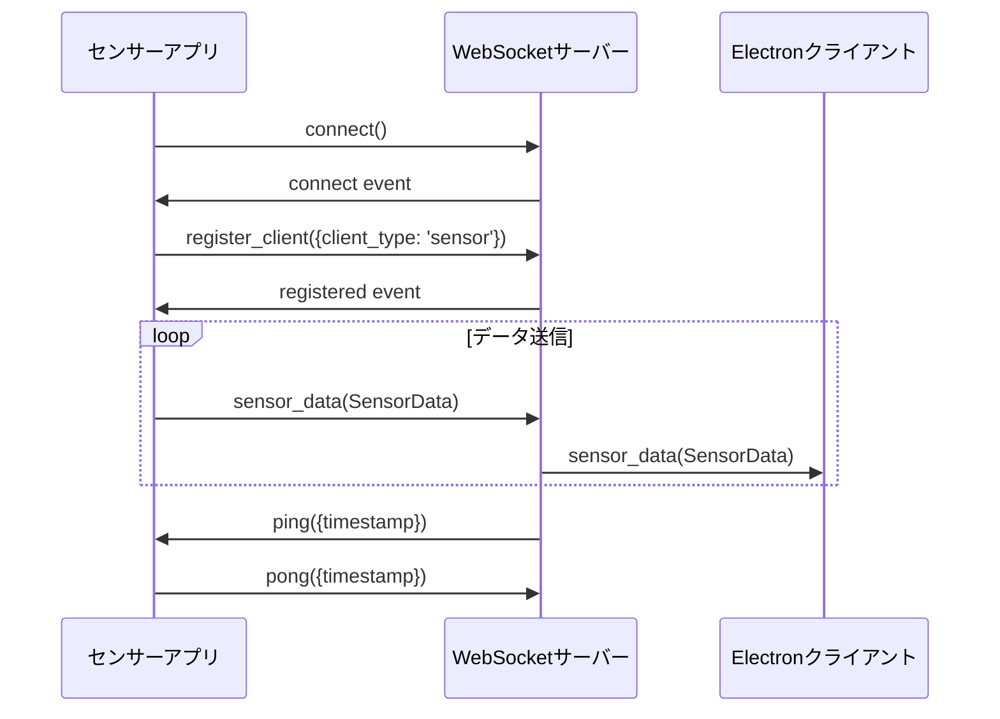

# センサーデータ連携アプリ開発仕様書

## 概要

この仕様書は、Raspberry Pi WebSocketサーバーと連携するセンサーデータ取得アプリケーションの開発に必要な情報をまとめています。

## WebSocketサーバー仕様

### 接続情報

| 項目 | 値 | 説明 |
|------|-----|------|
| プロトコル | WebSocket (Socket.io) | Socket.io v4.6.0以上 |
| デフォルトURL | `ws://localhost:3001` | 環境に応じて変更 |
| 名前空間 | `/` (デフォルト) | 特別な名前空間なし |
| 認証 | なし | 将来的にJWT認証予定 |

### クライアント登録

センサーアプリは接続後、必ずクライアントタイプを登録する必要があります。

```javascript
// 接続後すぐに実行
socket.emit('register_client', { client_type: 'sensor' });
```

**重要**: センサータイプのクライアントは同時に1つのみ接続可能です。新しいセンサークライアントが接続すると、既存の接続は自動的に切断されます。

## データ形式仕様

### センサーデータ (SensorData)

センサーアプリからサーバーに送信するデータ形式：

```typescript
interface SensorData {
  worker_status: WorkerStatus;     // 作業者状態（必須）
  robot_status: RobotStatus;       // ロボット状態（必須）
  screw_count: number;             // ネジ締め回数（必須）
  bolt_count: number;              // ボルト締め回数（必須）
  work_step: string;               // 現在の作業ステップ（必須）
  image?: string;                  // Base64エンコード画像（オプション）
  timestamp?: string;              // タイムスタンプ（オプション）
}
```

#### 作業者状態 (WorkerStatus)

```typescript
type WorkerStatus = "waiting" | "screw_tightening" | "bolt_tightening" | "tool_handover" | "absent";
```

| 値 | 説明 | 検出方法例 |
|---|------|-----------|
| `waiting` | 待機中 | 作業者が静止している状態 |
| `screw_tightening` | ネジ締め作業中 | ドライバー使用の姿勢検出 |
| `bolt_tightening` | ボルト締め作業中 | レンチ使用の姿勢検出 |
| `tool_handover` | 工具受け渡し中 | ロボットとの相互作用検出 |
| `absent` | 不在 | 作業者が検出されない状態 |

#### ロボット状態 (RobotStatus)

```typescript
interface RobotStatus {
  state: "waiting" | "operating";  // ロボット動作状態
  grip: "open" | "closed";         // グリップ状態
}
```

#### 画像データ (オプション)

```javascript
// Base64エンコード形式
"data:image/jpeg;base64,/9j/4AAQSkZJRgABAQAAAQABAAD..."
```

**推奨仕様**:
- 形式: JPEG
- 解像度: 640x480 以下
- 品質: 80% 以下
- サイズ: 100KB 以下

## 通信プロトコル

### 1. 接続フロー



### 2. イベント一覧

#### 送信イベント (センサーアプリ → サーバー)

| イベント名 | データ型 | 必須 | 説明 |
|-----------|---------|------|------|
| `register_client` | `{client_type: 'sensor'}` | ✅ | クライアント登録 |
| `sensor_data` | `SensorData` | ✅ | センサーデータ送信 |
| `pong` | `{timestamp: number}` | ✅ | ハートビート応答 |

#### 受信イベント (サーバー → センサーアプリ)

| イベント名 | データ型 | 説明 |
|-----------|---------|------|
| `connect` | - | 接続成功 |
| `registered` | `{client_type: string, id: string}` | 登録完了 |
| `ping` | `{timestamp: number}` | ハートビート |
| `error` | `{code: string, message: string}` | エラー通知 |
| `disconnect` | `{reason: string}` | 切断通知 |

### 3. エラーハンドリング

#### 一般的なエラーコード

| コード | 説明 | 対処方法 |
|-------|------|---------|
| `INVALID_CLIENT_TYPE` | 無効なクライアントタイプ | `client_type: 'sensor'`を指定 |
| `DUPLICATE_SENSOR_CLIENT` | センサークライアント重複 | 既存接続が切断されます |
| `INVALID_DATA_FORMAT` | データ形式不正 | SensorData形式を確認 |
| `CONNECTION_TIMEOUT` | 接続タイムアウト | ネットワーク接続を確認 |

## 実装要件

### 必須実装項目

1. **WebSocket接続管理**
   - Socket.ioクライアントライブラリの使用
   - 自動再接続機能
   - 接続状態の監視

2. **クライアント登録**
   - 接続後の即座な登録
   - 登録完了の確認

3. **データ送信**
   - 定期的なセンサーデータ送信（推奨: 1秒間隔）
   - データ形式の検証
   - 送信エラーのハンドリング

4. **ハートビート応答**
   - pingイベントへのpong応答
   - 接続維持

### 推奨実装項目

1. **ログ出力**
   - 接続状態の記録
   - エラー情報の記録
   - データ送信状況の記録

2. **設定管理**
   - サーバーURL設定
   - 送信間隔設定
   - センサー設定

3. **優雅な終了処理**
   - SIGINT/SIGTERMハンドリング
   - リソースの適切な解放

4. **パフォーマンス最適化**
   - データ圧縮
   - メモリ使用量の最適化
   - CPU使用率の監視

## センサー統合ガイド

### カメラセンサー

```python
import cv2
import base64

class CameraSensor:
    def __init__(self, camera_id=0):
        self.camera = cv2.VideoCapture(camera_id)
        # 解像度設定
        self.camera.set(cv2.CAP_PROP_FRAME_WIDTH, 640)
        self.camera.set(cv2.CAP_PROP_FRAME_HEIGHT, 480)
    
    def capture_image(self):
        ret, frame = self.camera.read()
        if not ret:
            return None
        
        # JPEG圧縮
        _, buffer = cv2.imencode('.jpg', frame, 
                               [cv2.IMWRITE_JPEG_QUALITY, 80])
        
        # Base64エンコード
        image_base64 = base64.b64encode(buffer).decode('utf-8')
        return f"data:image/jpeg;base64,{image_base64}"
    
    def detect_worker_status(self):
        # AI/MLモデルを使用した作業者状態検出
        # MediaPipe、YOLO、カスタムモデルなどを使用
        pass
```

### 振動センサー (Raspberry Pi GPIO)

```python
import RPi.GPIO as GPIO
import time

class VibrationSensor:
    def __init__(self, pin=18):
        self.pin = pin
        self.screw_count = 0
        
        GPIO.setmode(GPIO.BCM)
        GPIO.setup(self.pin, GPIO.IN, pull_up_down=GPIO.PUD_DOWN)
        
        # 割り込み設定
        GPIO.add_event_detect(self.pin, GPIO.RISING, 
                            callback=self._on_vibration, 
                            bouncetime=1000)
    
    def _on_vibration(self, channel):
        self.screw_count += 1
        print(f"Screw tightening detected. Count: {self.screw_count}")
    
    def get_screw_count(self):
        return self.screw_count
```

### I2Cセンサー

```python
import smbus
import time

class TorqueSensor:
    def __init__(self, i2c_address=0x48):
        self.bus = smbus.SMBus(1)  # I2C bus 1
        self.address = i2c_address
        self.bolt_count = 0
        self.torque_threshold = 50  # Nm
    
    def read_torque(self):
        try:
            # 16bit データ読み取り
            data = self.bus.read_i2c_block_data(self.address, 0, 2)
            raw_value = (data[0] << 8) | data[1]
            
            # スケーリング（センサー仕様に応じて調整）
            torque = raw_value * 0.1
            return torque
        except Exception as e:
            print(f"I2C read error: {e}")
            return 0
    
    def detect_bolt_tightening(self):
        torque = self.read_torque()
        if torque > self.torque_threshold:
            self.bolt_count += 1
            return True
        return False
```

## デプロイメント

### systemdサービス化

```ini
# /etc/systemd/system/sensor-app.service
[Unit]
Description=Manufacturing Sensor Data Collection App
After=network.target
Wants=network-online.target

[Service]
Type=simple
User=pi
Group=pi
WorkingDirectory=/home/pi/sensor-app
ExecStart=/usr/bin/python3 sensor_app.py
Restart=always
RestartSec=10
StandardOutput=journal
StandardError=journal

# 環境変数
Environment=WEBSOCKET_URL=ws://localhost:3001
Environment=PYTHONPATH=/home/pi/sensor-app

# リソース制限
MemoryLimit=256M
CPUQuota=50%

[Install]
WantedBy=multi-user.target
```

### 起動・管理

```bash
# サービス登録
sudo cp sensor-app.service /etc/systemd/system/
sudo systemctl daemon-reload

# 自動起動有効化
sudo systemctl enable sensor-app

# サービス開始
sudo systemctl start sensor-app

# 状態確認
sudo systemctl status sensor-app

# ログ確認
sudo journalctl -u sensor-app -f
```

## テスト方法

### 1. 接続テスト

```bash
# WebSocketサーバーの起動確認
curl http://localhost:3001/health

# 期待される応答
{
  "status": "ok",
  "timestamp": "2024-01-01T12:00:00.000Z",
  "connections": {
    "sensor": 0,
    "electron": 0,
    "robot": 0,
    "total": 0
  },
  "sensor_connected": false,
  "robot_connected": false
}
```

### 2. データ送信テスト

```javascript
// テスト用スクリプト
const io = require('socket.io-client');

const socket = io('ws://localhost:3001');

socket.on('connect', () => {
  console.log('Connected');
  
  // センサー登録
  socket.emit('register_client', { client_type: 'sensor' });
});

socket.on('registered', (data) => {
  console.log('Registered:', data);
  
  // テストデータ送信
  const testData = {
    worker_status: 'waiting',
    robot_status: { state: 'waiting', grip: 'closed' },
    screw_count: 0,
    bolt_count: 0,
    work_step: 'waiting',
    timestamp: new Date().toISOString()
  };
  
  socket.emit('sensor_data', testData);
  console.log('Test data sent');
});
```

### 3. 負荷テスト

```bash
# WebSocketサーバーの負荷テスト実行
cd /path/to/websocket-server
npm run test:load
```

## トラブルシューティング

### よくある問題

#### 1. 接続できない

**症状**: `connect_error` イベントが発生
**原因**: 
- WebSocketサーバーが起動していない
- ファイアウォールでポートがブロックされている
- ネットワーク接続の問題

**対処法**:
```bash
# サーバー状態確認
curl http://localhost:3001/health

# ポート確認
netstat -an | grep 3001

# ファイアウォール確認
sudo ufw status
```

#### 2. データが送信されない

**症状**: `sensor_data` イベントが無視される
**原因**:
- クライアント登録が完了していない
- データ形式が不正
- 必須フィールドが不足

**対処法**:
```javascript
// 登録完了を確認してからデータ送信
socket.on('registered', () => {
  // ここでデータ送信開始
});

// データ形式を確認
const data = {
  worker_status: 'waiting',        // 必須
  robot_status: {                  // 必須
    state: 'waiting',
    grip: 'closed'
  },
  screw_count: 0,                  // 必須
  bolt_count: 0,                   // 必須
  work_step: 'waiting'             // 必須
};
```

#### 3. 接続が頻繁に切断される

**症状**: `disconnect` イベントが頻発
**原因**:
- ハートビートに応答していない
- ネットワークが不安定
- サーバーのタイムアウト設定

**対処法**:
```javascript
// ハートビート応答の実装
socket.on('ping', (data) => {
  socket.emit('pong', data);
});

// 自動再接続の設定
const socket = io('ws://localhost:3001', {
  reconnection: true,
  reconnectionAttempts: 10,
  reconnectionDelay: 1000
});
```

### ログ確認

```bash
# アプリケーションログ
tail -f /var/log/sensor-app.log

# systemdログ
sudo journalctl -u sensor-app -f

# WebSocketサーバーログ
tail -f /home/pi/raspberry-pi-websocket-server/logs/server-*.log
```

## パフォーマンス最適化

### メモリ使用量削減

1. **画像データの最適化**
   - 解像度を640x480以下に制限
   - JPEG品質を80%以下に設定
   - 不要な画像データのキャッシュを避ける

2. **データ送信の最適化**
   - 変更があった場合のみ送信
   - バッチ処理の実装
   - 圧縮の使用

### CPU使用率削減

1. **センサー読み取りの最適化**
   - 適切なサンプリング周波数
   - 割り込み処理の使用
   - 非同期処理の実装

2. **画像処理の最適化**
   - OpenCVの最適化オプション
   - マルチスレッド処理
   - GPU加速の利用

## セキュリティ考慮事項

### 通信セキュリティ

1. **TLS/SSL暗号化**
   ```javascript
   // HTTPS/WSS接続
   const socket = io('wss://your-server:443', {
     secure: true,
     rejectUnauthorized: true
   });
   ```

2. **認証トークン**
   ```javascript
   // JWT認証（将来実装予定）
   const socket = io('wss://your-server:443', {
     auth: {
       token: 'your-jwt-token'
     }
   });
   ```

### データセキュリティ

1. **機密データの除外**
   - 個人識別可能な情報の除去
   - 不要な詳細情報の送信回避

2. **データ検証**
   - 送信前のデータ検証
   - 異常値の検出と除外

## サポート・連絡先

### ドキュメント

- [WebSocketサーバー仕様](../README.md)
- [API型定義](../src/types/index.ts)
- [テスト例](../tests/)

### 実装例

- [JavaScript実装](javascript/)
- [Python実装](python/)
- [C++実装](cpp/)

### 問題報告

問題が発生した場合は、以下の情報を含めて報告してください：

1. 使用している実装言語とバージョン
2. エラーメッセージとスタックトレース
3. 再現手順
4. 環境情報（OS、Node.js/Pythonバージョンなど）
5. ログファイル